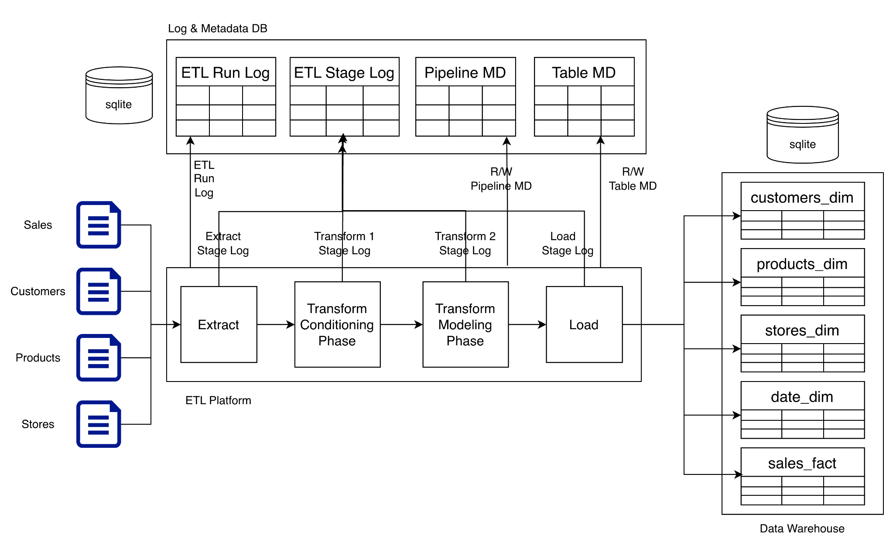

# Retail Sales ETL Pipeline (Pandas → SQLite)

An **end-to-end, production-style ETL pipeline** that ingests raw retail CSV datasets, applies structured data conditioning and dimensional modeling using **Pandas**, and loads analytics‑ready **fact and dimension tables** into **SQLite**, backed by a full **logging and metadata control plane**.

This project is designed to mirror **real-world data engineering systems**, scaled down to a local, framework‑free environment.

---

## 🧠 Project Objectives

- Build a **clean, modular ETL system** (Extract → Transform → Load)
- Separate **data processing**, **logging**, and **metadata control**
- Model data into **fact and dimension tables**
- Enable **SQL-based analytics**
- Design for **reruns, debuggability, and future extensibility**

---

## 🏗️ High-Level Architecture

### Logical Components

- **Raw Data Landing** (CSV files on local filesystem)
- **ETL Platform**
  - Extract
  - Transform Phase 1 (Conditioning)
  - Transform Phase 2 (Modeling)
  - Load
  - Post-load Validation
- **Log & Metadata Database** (SQLite)
- **Data Warehouse Database** (SQLite)

---

## 🔁 ETL Flow

```
Raw CSVs
   ↓
Extract
   ↓
Transform – Conditioning
   ↓
Transform – Modeling
   ↓
Load → Warehouse
   ↓
Post-load Validation
```

Each stage emits logs and interacts with metadata tables.

---

## 📦 Data Sources

Raw CSV datasets (example):

- sales.csv
- customers.csv
- products.csv
- stores.csv

All raw files are treated as **immutable inputs**.

---

## 🧩 Transform Strategy

### Phase 1 — Data Conditioning
Purpose: make data **safe and consistent**

- Handle missing values
- Type conversions (dates, numerics, categories)
- Deduplication
- Basic sanity checks

Output: clean, source-shaped DataFrames

---

### Phase 2 — Data Modeling
Purpose: make data **analytics-ready**

- Build dimension tables
- Define fact table grain
- Feature engineering (e.g. revenue, discounts)
- Enforce logical foreign-key integrity

Output: fact and dimension DataFrames

---

## 🗄️ Warehouse Schema

### Dimension Tables
- `customers_dim`
- `products_dim`
- `stores_dim`
- `date_dim`

### Fact Table
- `sales_fact`  
  *Grain: one row per sales transaction*

---

## 📊 Logging Design

### ETL Run Log
Tracks pipeline-level executions.

Example:
- pipeline start / end
- success or failure
- error messages

### ETL Stage Log
Tracks individual stage events.

Stages logged:
- EXTRACT
- TRANSFORM_P1
- TRANSFORM_P2
- LOAD
- VALIDATION

Logs are **append-only** and never mutated.

---

## 🧠 Metadata Control Plane

Metadata tables define **how the system behaves**.

### Pipeline Metadata
Defines:
- pipeline name
- source
- load strategy
- activation state

### Table Metadata
Defines:
- table name
- grain
- load type
- last load timestamp
- row counts

### Pipeline ↔ Table Mapping
Defines:
- which pipeline loads which tables
- load order
- table role (dimension / fact)

> ETL logic reads metadata **before execution** and updates it **only on success**.

---

## ✅ Validation Layer

Executed **after loading** and before analytics access.

Checks include:
- row count reconciliation
- null checks on critical columns
- duplicate key detection
- referential integrity validation

Validation results are logged as ETL stages.

---

## 📂 Project Structure

```
retail-sales-etl/
├── etl/
│   ├── extract.py
│   ├── transform_p1.py
│   ├── transform_p2.py
│   ├── load.py
│   └── validate.py
│
├── runner/
│   └── pipeline_runner.py
│
├── sql/
│   ├── metadata_ddl.sql
│   └── warehouse_ddl.sql
│
├── docs/
│   └── system_design.png
│
├── tests/
│   └── test_etl.py
│
├── README.md
├── requirements.txt
├── .gitignore
└── .env.example

```
---
## 🏗️ System Design

<p align="center">
  <a href="docs/system_design.png">
    
  </a>
</p>

---

## 🚀 Future Enhancements

- Incremental loading via watermarks
- Slowly Changing Dimensions (Type 1 / Type 2)
- Migration to PostgreSQL
- Orchestration with Airflow
- Data quality metrics dashboard

---

## 🧪 Design Principles

- Separation of concerns
- Deterministic and rerunnable pipelines
- Explicit schemas and grain
- Metadata-driven behavior
- Minimal dependencies

---

## 🏁 Status

✅ Architecture finalized and locked  
🚧 Implementation in progress

---

## 📌 One-Line Summary

> A production-style ETL pipeline using Pandas and SQLite with full logging, metadata control, and dimensional modeling for retail analytics.
